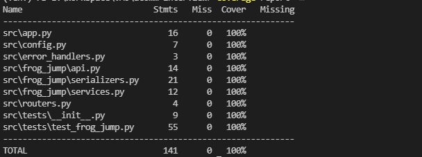

# Frog jumping over the lake problem

This project is intend to solve the frog jumping over a lake problem.

## Solution explain:
- First create a list, let's call it step list, with the size equal to the length of the river and contains only `False` value.
- Then iterate over the leaves list and flip the item in the step list with 
index = (item-in-leaves-list-1) to `True` and count the seconds needed.
- Then check if the items in step list are:
    - All `True` => The frog can jump over the river.
    - At least 1 `False` => The frog cannot jump over the river.
- Algorithm Complexity: O(N)
- To see more details, please refer to [this file](./src/frog_jump/services.py)


## Prerequisite
- Python > 3.6
- Pip
- Docker
- Docker-compose (Optional)

## Installation
1. Run in local environment
- First install the requirements using

```
> pip install -r requirements.txt
```

- Then copy content from `{root}/env.example` to `{root}/.env`

E.x:

```
DEBUG=false
HOST=0.0.0.0
PORT=8000
```

- Then run `python manage.py`

2. Run using docker
- Copy content from `{root}/env.example` to `{root}/.env`

E.x:

```
DEBUG=false
HOST=0.0.0.0
PORT=8000
DOCKER_PUBLIC_PORT=9999 => this is where we expost the port, for the specific requirements, this should be set to 9999
```

- If you are using docker-compose, simply run:

```
> docker-compose up --build
```

- If you are running plain docker, run:

```
> docker build . -t <your-image-name>
> docker run <your-image-name> --env-file=.env
```

3. Testing API
The API can be called at `{host}:{port}/` with `POST` method and the payload like the example below:

```
> curl --location --request POST '127.0.0.1:8000' \
    --header 'Content-Type: application/json' \
    --data-raw '{
        "leave_lists": [<pass-your-leaves-list-here>],
        "river_length": <pass-your-river-here>
    }'
```

An example payload:

```
{
    "leave_lists": [1,2,3,4,5],
    "river_length": 5
}
```

You should get a response like this:


```
{
    "msg": "Frog can jump",
    "jump_at": 4
}
```

If the frog cannot jump over the river, the response should be like this:

```
{
    "msg": "Frog cannot jump",
    "jump_at": -1
}
```


## Unit testing and coverage
- To run unit testing, setup your project as local environment.
- Then run the following:

    ```
    > pip install -r test_requirements.txt
    
    > coverage run -m pytest src/tests
    ```
- To see the coverage report, run:

    ```
    > coverage report -m
    ```

- Coverage results:

    

